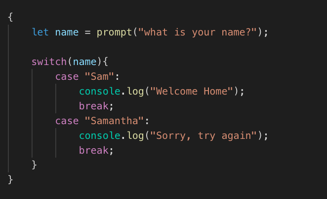
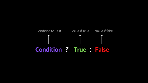
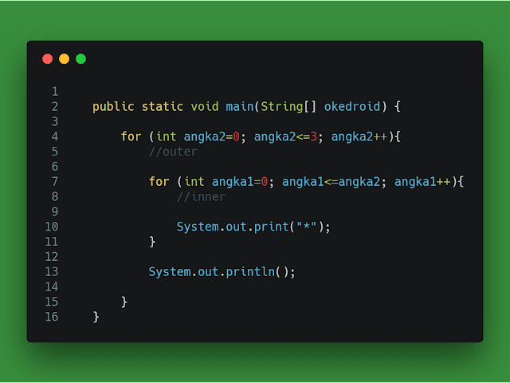

<!-- # presentation1-Js- -->
# JavaScript History:

Анонсирован этот язык был 18 июля 1996 года. Первым браузером, поддерживающим эту реализацию, был Internet Explorer 3.0. По инициативе компании Netscape была проведена стандартизация языка ассоциацией ECMA. Стандартизированная версия имеет название ECMAScript, описывается стандартом ECMA-262.

# DataTypes in JavaScript:

JavaScript has 8 Datatypes
1. String
2. Number
3. Bigint
4. Boolean
5. Undefined
6. Null
7. Symbol
8. Object

The Object Datatype
The object data type can contain:

1. An object
2. An array
3. A date

# Conditions in JavaScript:
## 1.If/Else Condition :

Оператор if/else выполняет блок кода, если указанное условие истинно. Если условие ложное, может быть выполнен другой блок кода. Оператор if/else является частью "Условных" инструкций JavaScript, которые используются для выполнения различных действий на основе разных условий.

## 2.Switch Case  Condition :

Оператор switch оценивает выражение, сопоставляя значение выражения с серией предложений case, и выполняет операторы после первого предложения case с совпадающим значением, пока не встретится оператор break. Предложение по умолчанию оператора switch будет выполнено, если ни один регистр не соответствует значению выражения.

## 3.Ternary Operator :

Условный (тернарный) оператор является единственным оператором JavaScript, который принимает три операнда: условие, за которым следует вопросительный знак ( ? ), затем выражение для выполнения, если условие истинно, за которым следует двоеточие ( : ), и, наконец, выражение для выполнить, если условие ложно.

# Loops in JavaScript:
## Loop For :

## Простой цикл for такой же, как и C/C++. Мы можем инициализировать переменную, проверить условие и значение приращения/уменьшания. Он состоит из четырех частей:

#### Инициализация: это начальное условие, которое выполняется один раз при запуске цикла. Здесь мы можем инициализировать переменную или использовать уже инициализированную переменную. Это необязательное условие.
#### Условие: Это второе условие, которое выполняется каждый раз для проверки состояния цикла. Он продолжает выполнение до тех пор, пока условие не станет ложным. Он должен возвращать логическое значение true или false. Это необязательное условие.
#### Увеличение/Уменьшение: Увеличивает или уменьшает значение переменной. Это необязательное условие.
#### Оператор: Оператор цикла выполняется каждый раз, пока второе условие не станет ложным.

# Loop While:
 

Оператор while создает цикл, который выполняет указанный оператор до тех пор, пока условие проверки оценивается как истинное. Условие оценивается перед выполнением инструкции.

# Loop Do While :

Оператор do...while создает цикл, который
выполняет указанный оператор до тех пор, пока условие проверки не станет ложным. Условие оценивается после выполнения оператора, в результате чего указанный оператор выполняется хотя бы один раз.

# Functions in JavaScript :

### Функция в JavaScript похожа на процедуру — набор операторов, которые выполняют задачу или вычисляют значение, но для того, чтобы процедуру можно было квалифицировать как функцию, она должна принимать некоторые входные данные и возвращать выходные данные, где существует некоторая очевидная связь между вход и выход.

##  There are 3 ways of writing a function in JavaScript

1. Function Declaration
2. Function Expression
3. Arrow Function Expression

