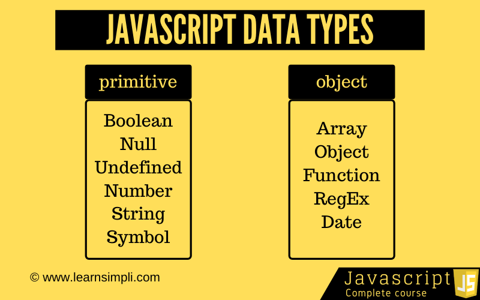

<!-- # presentation1-Js- -->
# JavaScript History:

Анонсирован этот язык был 18 июля 1996 года. Первым браузером, поддерживающим эту реализацию, был Internet Explorer 3.0. По инициативе компании Netscape была проведена стандартизация языка ассоциацией ECMA. Стандартизированная версия имеет название ECMAScript, описывается стандартом ECMA-262.

# DataTypes in JavaScript:

JavaScript has 8 Datatypes
1. String
2. Number
3. Bigint
4. Boolean
5. Undefined
6. Null
7. Symbol
8. Object

The Object Datatype
The object data type can contain:

1. An object
2. An array
3. A date

# Conditions in JavaScript:
## 1.If/Else Condition :

Оператор if/else выполняет блок кода, если указанное условие истинно. Если условие ложное, может быть выполнен другой блок кода. Оператор if/else является частью "Условных" инструкций JavaScript, которые используются для выполнения различных действий на основе разных условий.

## 1.Switch Case  Condition :
1

Оператор switch оценивает выражение, сопоставляя значение выражения с серией предложений case, и выполняет операторы после первого предложения case с совпадающим значением, пока не встретится оператор break. Предложение по умолчанию оператора switch будет выполнено, если ни один регистр не соответствует значению выражения.
